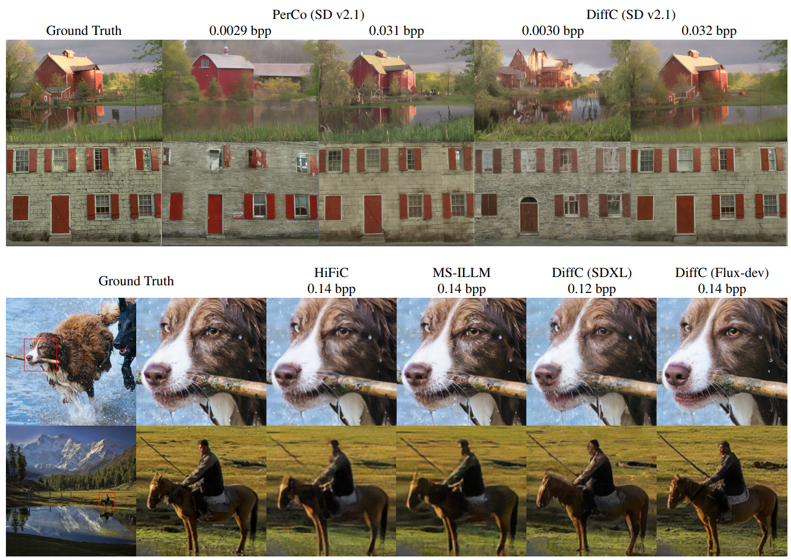

# Lossy Compression with Pretrained Diffusion Models

Official implementation of our ICLR 2025 paper [Lossy Compression with Pretrained Diffusion Models](https://arxiv.org/abs/2501.09815) by Jeremy Vonderfect and Feng Liu. See our [project page](https://jeremyiv.github.io/diffc-project-page/) for an interactive demo of results.

## Abstract

We present a lossy compression method that can leverage state-of-the-art diffusion models for entropy coding. Our method works _zero-shot_, requiring no additional training of the diffusion model or any ancillary networks. We apply the DiffC algorithm[^1] to
[Stable Diffusion](https://huggingface.co/stabilityai/stable-diffusion-2-1) 1.5, 2.1, XL, and [Flux-dev](https://huggingface.co/black-forest-labs/FLUX.1-dev).
We demonstrate that our method is competitive with other state-of-the-art generative compression methods at low ultra-low bitrates.

## Results

We compare our method (DiffC) against [PerCo](https://github.com/Nikolai10/PerCo), [DiffEIC](https://github.com/huai-chang/DiffEIC), [HiFiC](https://github.com/Justin-Tan/high-fidelity-generative-compression), and [MS-ILLM](https://github.com/facebookresearch/NeuralCompression/tree/main/projects/illm).



In the following rate-distortion curves, SD1.5, SD2.1, SDXL, and Flux represent the DiffC algorithm with those respective diffusion models. The dashed horizontal 'VAE' lines represent the best achievable metrics given the fidelity of the model's variational autoencoder.


## Setup

```
git clone https://github.com/JeremyIV/diffc.git
cd diffc
conda env create -f environment.yml
conda activate diffc
```

## Usage

```
python evaluate.py --config configs/SD-1.5-base.yaml --image_dir data/kodak --output_dir results/SD-1.5-base/kodak
```

To save the compressed representation of an image as a `diffc` file, use

```
python compress.py --config configs/SD-1.5-base.yaml --image_dir data/kodak --output_dir results/SD-1.5-base/kodak/compressed --recon_timestep 200
```

To reconstruct an image/images from their compressed representations, use

```
python decompress.py --config configs/SD-1.5-base.yaml --input_dir results/SD-1.5-base/kodak/compressed --output_dir results/SD-1.5-base/kodak/reconstructions
```

Note that currently, compress and decompress.py only work with `SD-1.5-base.yaml`. To make them work with the other configs, you would need to specify `manual_dkl_per_step` in the config file.

## Citation

```bibtex
@inproceedings{
  vonderfecht2025lossy,
  title={Lossy Compression with Pretrained Diffusion Models},
  author={Jeremy Vonderfecht and Feng Liu},
  booktitle={The Thirteenth International Conference on Learning Representations},
  year={2025},
  url={https://openreview.net/forum?id=raUnLe0Z04}
}
```

## Acknowledgements

Thanks to https://github.com/danieleades/arithmetic-coding for the entropy coding library.

[^1]: Theis, L., Salimans, T., Hoffman, M. D., & Mentzer, F. (2022). [Lossy compression with gaussian diffusion](https://arxiv.org/abs/2206.08889). arXiv preprint arXiv:2206.08889.
[^2]: Ho, J., Jain, A., & Abbeel, P. (2020). [Denoising diffusion probabilistic models](https://arxiv.org/abs/2006.11239). Advances in Neural Information Processing Systems, 33, 6840-6851.
